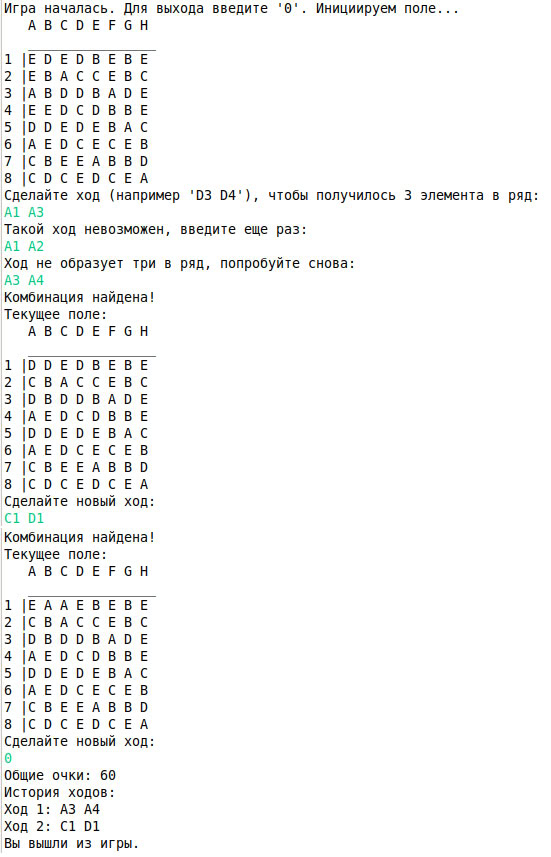

## Игра "Три в ряд" (Match-three-game)

_В данном репозитории расположен проект консольной игры "Три в ряд", при разработке которой автор старался придерживаться методике проектирования Бертрана Майера. Более подробно шаги описаны [здесь](https://github.com/tatyana86/match-three/tree/main)._

Для запуска программы необходимо склонировать репозиторий,  в консоли перейти в директорию с проектом и выполнить команды:

```
mvn clean package
java -jar target/game-0.0.1-SNAPSHOT.jar
```

Пример игры:

